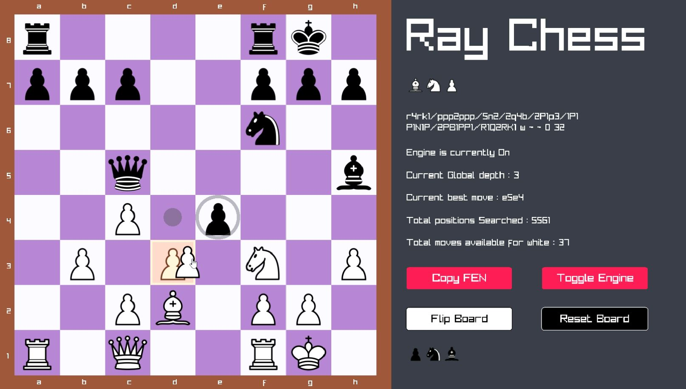

# Ray Chess

Ray Chess is a custom-built chess engine designed for efficient and intelligent chess gameplay. It incorporates key features of modern chess engines, such as move generation, evaluation, and search algorithms.

This project also includes a UI that can be used with any custom chess engine. The only requirement is that your engine must have a method that accepts moves in long algebraic notation and returns the best move in the same format.

## Build Instructions

1. **C++ Compiler**: Ensure you have a modern C++ compiler installed. If you are using GCC/G++, make sure it is the latest version. Older versions of GCC/G++ may not work with raylib. We highly recommend using [w64devkit](https://github.com/skeeto/w64devkit), as it includes the latest GCC and other necessary tools.

2. **Raylib (Optional)**: Download [raylib](https://github.com/raysan5/raylib) and place it in the `C:/` directory, with the root folder named `raylib`.

3. **Building the Project**: 
   - Navigate to the root folder of the chess engine.
   - Run the command `make`. If Raylib is downloaded in the correct path, it should build automatically. If not, the build process will automatically download and build Raylib.

## Current Features

- **Bitboard Representation**: Efficient board representation using [bitboards](https://www.chessprogramming.org/Bitboards) for faster computations.
- **Legal Move Generation**: Generates legal moves and outputs them in long algebraic notation.
- **Save Position**: Allows you to save the current position as [FEN (Forsyth-Edwards Notation)](https://en.wikipedia.org/wiki/Forsyth%E2%80%93Edwards_Notation) for later analysis in advanced engines like Stockfish.

## Planned Features

- **Built-in Engine**: A built-in engine for playing against and analyzing positions.
- **Customizable UI**: Configuration file to allow users to adjust the UI's appearance according to their preferences.
- **Evaluation Bar**: Display an evaluation bar showing which side has the advantage.

## Contributing

We welcome pull requests! If you're planning to make major changes, please open an issue first to discuss your proposed changes.

## License

This project is licensed under the [MIT License](https://choosealicense.com/licenses/mit/).
